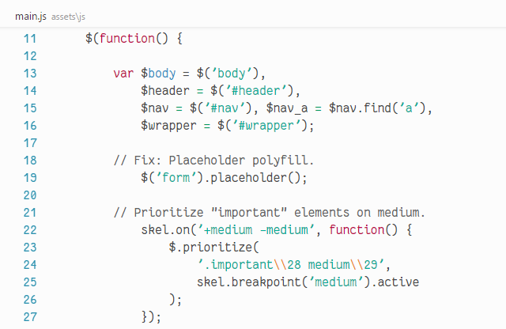

# FlatUI

A light syntax theme for VS Code.

## My Other extensions

- ### [Quick Task](https://marketplace.visualstudio.com/items?itemName=lkytal.quicktask)
- ### [Pomodoro](https://marketplace.visualstudio.com/items?itemName=lkytal.pomodoro)
- ### [Coffee Lint](https://marketplace.visualstudio.com/items?itemName=lkytal.coffeelinter)
- ### [Translator Plus](https://marketplace.visualstudio.com/items?itemName=lkytal.translatorplus)

## Release Note

### 1.2.1

- Fix lib variable

### 1.2.0

- Separate variable color scheme

### 1.1.1

- Refine color scheme

### 1.1.0

- Refine color scheme

### 1.0.0

- Initial release of FlatUI

## Acknowledgment

> Inspired by the [Flat theme](https://marketplace.visualstudio.com/items?itemName=gerane.Theme-Flat)
> 
Icons made by <a href="http://www.flaticon.com/authors/vectors-market" title="Vectors Market">Vectors Market</a> from <a href="http://www.flaticon.com" title="Flaticon">www.flaticon.com</a> is licensed by <a href="http://creativecommons.org/licenses/by/3.0/" title="Creative Commons BY 3.0" target="_blank">CC 3.0 BY</a>

